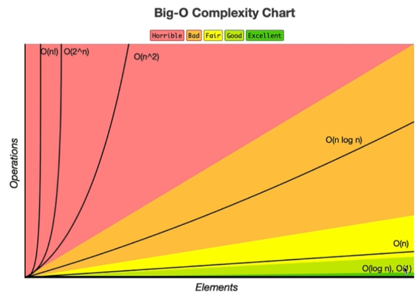

# Big O
- Big O is the metric we use to describe the efficency of algorithms
- To make decision which algorithm is better irrespective of the software/programming language/hardware used we use Big O
- Big O tells how the algorithm performs with increase in input size
- We can express algorithmic complexity using the big-O notation. For a problem of size N:
    - A constant-time function/method is “order 1” : O(1)
    - A linear-time function/method is “order N” : O(N)
    - A quadratic-time function/method is “order N squared” : O(N 2 )
- Big O Notations
    - Best case
    - Average case
    - Worst case
> O(1)>O(logN)>O(N)>O(NlogN)>O(N^2)>O(2^N)>O(N!)

- The general step wise procedure for Big-O runtime analysis is as follows:  
    1. Figure out what the input is and what n represents.
    2. Express the maximum number of operations, the algorithm performs in terms of n.
    3. Eliminate all excluding the highest order terms.
    4. Remove all the constant factors.

    