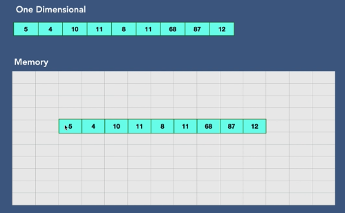
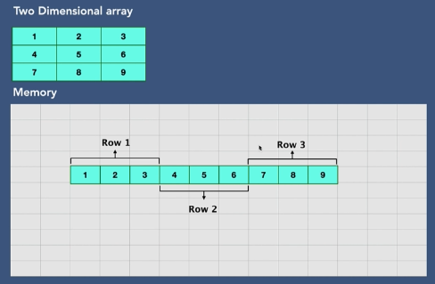
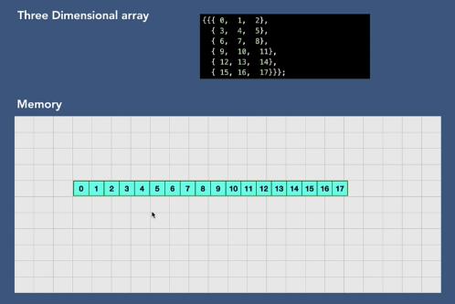

# Arrays
- Array is a collection of objects or things
- Array can store data of specific data type (homogenous). It we try to add different data type it throws error
- Arrays are created in contigous location in memory
- Each element has unique index, array element can access at given index very quickly
- Size of array is pre-defined and cannot be changed

> In computer science, an array is a data strcuture consisting of a collection of elements each identified by at atleast one array index or key. An array is stored such that the position of each element can be computed from its index by a mathematical formula

- Why array?
- Instead of storing hundreds of variables of same data type related to each other like marks of 100 students e.g
```java
int student_1=10;
int student_2=20;
int student_3=30;
int student_4=40;
```
- we can store it in one variable using array
```java
int[] students={10,20,30,40};
```

### Types of arrays
1. One Dimension:
2. Multi Dimension:
    - two dimension - like a matrix (rows and columns)
    - three dimension
    - four dimension
    - ...
- 1D arrays are also located as 1d array in memory


- 2D arrays are also located as 1d array in memory


- 3D arrays are also located as 1d array in memory


### Creating an array
- When we create an array
    - Declare: creates reference. It stores the initial address to the actual array
    - Instantiation of array: creates an array. Complier allocates memory. Default values are 0 for integers.
    - Initialization - assigns value to cells in array
- reason why array access operation is fast is because the the program just adds the index number to the initial address of array to exactly know the position instead of linear search with every element i.e the reason why index start form 0 as we add 0 to initial address to reach 1st element

### Ways of creating 1D array
```java
int[] intArray;
intArray = new int[3];
intArray[0] = 7;
intArray[1] = 4;
intArray[2] = 5;

// All operation take O(1) and to add N elements it takes O(N) in total

/*---------------OR----------------*/
String[] strArr = {"abc","cde","efg"}; // It takes O(1) to create array using this format

/*---------------OR----------------*/
int[] newArray = new int[4];
newArray[0] = 7;
newArray[1] = 4;
newArray[2] = 5;
newArray[3] = 9;
```

### Print array

```java
for(int i=0;i<arr.length;i++){ 
    System.out.println(arr[i]);  
}        

/*---------------OR----------------*/
for (String str : city){  
    System.out.println(str);  
} 

/*---------------OR----------------*/
import java.util.Arrays;
System.out.println(Arrays.toString(intArray));
```

