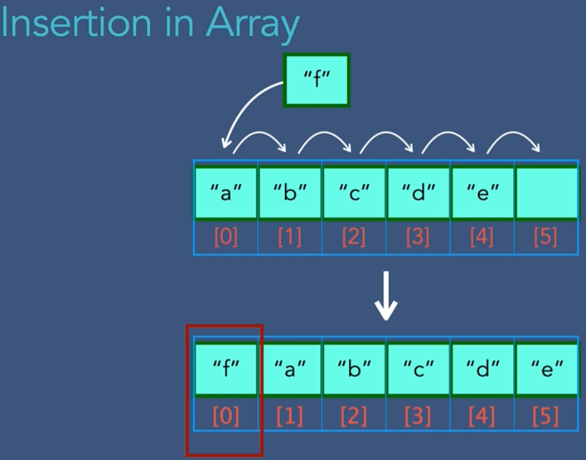
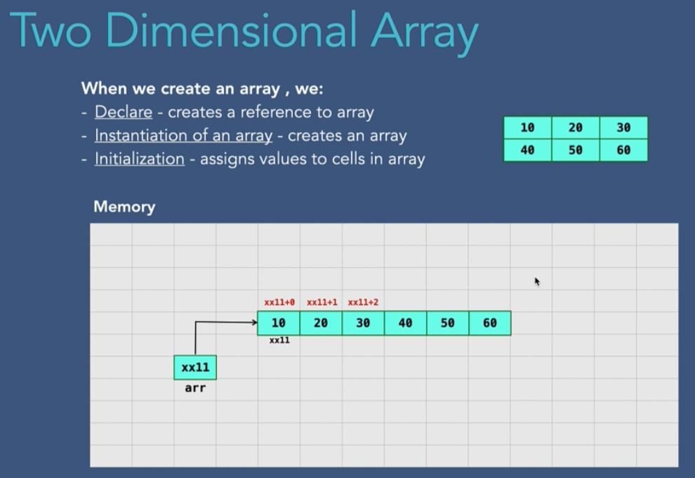

# Arrays
- Array is a collection of objects or things
- Array can store data of specific data type (homogenous). It we try to add different data type it throws error
- Arrays are created in contigous location in memory
- Each element has unique index, array element can access at given index very quickly
- Size of array is pre-defined and cannot be changed

> In computer science, an array is a data strcuture consisting of a collection of elements each identified by at atleast one array index or key. An array is stored such that the position of each element can be computed from its index by a mathematical formula

- Why array?
- Instead of storing hundreds of variables of same data type related to each other like marks of 100 students e.g
```java
int student_1=10;
int student_2=20;
int student_3=30;
int student_4=40;
```
- we can store it in one variable using array
```java
int[] students={10,20,30,40};
```

## Types of arrays
1. One Dimension:
2. Multi Dimension:
    - two dimension - like a matrix (rows and columns)
    - three dimension
    - four dimension
    - ...
- 1D arrays are also located as 1d array in memory


- 2D arrays are also located as 1d array in memory


- 3D arrays are also located as 1d array in memory


# 1D Array
## Creating an array
- When we create an array
    - Declare: creates reference. It stores the initial address to the actual array
    - Instantiation of array: creates an array. Complier allocates memory. Default values are 0 for integers.
    - Initialization - assigns value to cells in array
- Reason why array access operation is fast is because the the program just adds the index number to the initial address of array to exactly know the position instead of linear search with every element i.e the reason why index start form 0 as we add 0 to initial address to reach 1st element

## Ways of creating 1D array
```java
int[] intArray; //Declare
intArray = new int[3]; //Instantiation (will have default values of the data type)
intArray[0] = 7; //Initialization
intArray[1] = 4; //Initialization
intArray[2] = 5; //Initialization

// All operation take O(1) and to add N elements it takes O(N) in total

/*---------------OR----------------*/
String[] strArr = {"abc","cde","efg"}; // It takes O(1) to create array using this format

/*---------------OR----------------*/
int[] newArray = new int[4];
newArray[0] = 7;
newArray[1] = 4;
newArray[2] = 5;
newArray[3] = 9;
```

## Print array/ Traverse array

```java
for(int i=0;i<arr.length;i++){ 
    System.out.println(arr[i]);  
}        

/*---------------OR----------------*/
for (String str : city){  
    System.out.println(str);  
} 

/*---------------OR----------------*/
import java.util.Arrays;
System.out.println(Arrays.toString(intArray));
```
- If we have to insert a element in first place of array then we would have to move all elements to right by 1 position so the time complexity to insert element (at 1st place) is O(N)

- Usually if array if full we will fail the operation, if we really want to insert an element to full array, we would have to create a new array with bigger size and copy old elements to new array and insert new element

```java
int minValue = Integer.MIN_VALUE  //minimum integer value
int maxValue = Integer.MAX_VALUE  //maximum integer value
```

- Practically we cannot delete array elemet in Java, array size is fixed in java, so we can just update the value to any default value we want  which is generally Integer.MIN_VALUE

# 2D Array


## Create 2d array
- When we create an array
    - Declare: creates reference. It stores the initial address to the actual array
    - Instantiation of array: creates an array. Complier allocates memory. Default values are 0 for integers.
    - Initialization - assigns value to cells in array

```java
int[][] arr; //Declare
arr = new int[2][2]; //Instantiation (will have default values of the data type)
arr[0][0] = 1; //Initialization
arr[0][1] = 2; //Initialization
arr[1][0] = 3; //Initialization
arr[1][1] = 4; //Initialization

// All operation take O(1) and to add M,N elements it takes O(MN) in total
/*---------------OR----------------*/
String[][] strArr = {{"a","b"},{"c","d"}}; // It takes O(1) to create array using this format

/*---------------OR----------------*/
int[][] arr = new int[2][2];
arr[0][0] = 1;
arr[0][1] = 2;
arr[1][0] = 3;
arr[1][1] = 4;
```
## Print array/ Traverse array
```java
for(int i=0; i< values.length; i++){
    for(int j=0; j< values[i].length; j++){
        System.out.print(values[i][j] + "\t");
    }
    System.out.println("");
}        

/*---------------OR----------------*/
for (int[] eachRow : contents){
    for (int j : eachRow){
        System.out.print(j + "\t");
    }
    System.out.println("");
}

/*---------------OR----------------*/
import java.util.Arrays;
System.out.println(Arrays.deepToString(arr));
```

## Time and Space Complexity

### 1D Array
|Operation |Time Complexity |Sapce Complexity|
|---|---|---|
|Creating an empty array|O(1)|O(N)|
|Insert array element   |O(1)|O(1)|
|Traverse array         |O(N)|O(1)|
|Accessing array element|O(1)|O(1)|
|Search array element   |O(N)|O(1)|
|Delete array element   |O(1)|O(1)|
- If we know index value it takes TC:O(1) , else we have to traverse whole array therfore TC:O(N)

### 2D Array
|Operation |Time Complexity |Sapce Complexity|
|---|---|---|
|Creating an empty array|O(1)|O(MN)|
|Insert array element   |O(1)|O(1)|
|Traverse array         |O(MN)|O(1)|
|Accessing array element|O(1)|O(1)|
|Search array element   |O(MN)|O(1)|
|Delete array element   |O(1)|O(1)|
- If we know index value it takes TC:O(1) , else we have to traverse whole array therfore TC:O(MN)

## Advantages and Disadvantages

### Advantage
- To store multiple variables of same data type
- Random access is of O(1)

### Disadvantage
- Can store only same data type elements
- Fixed memory size, if we want to expand we have to copy to new array and old array still takes space